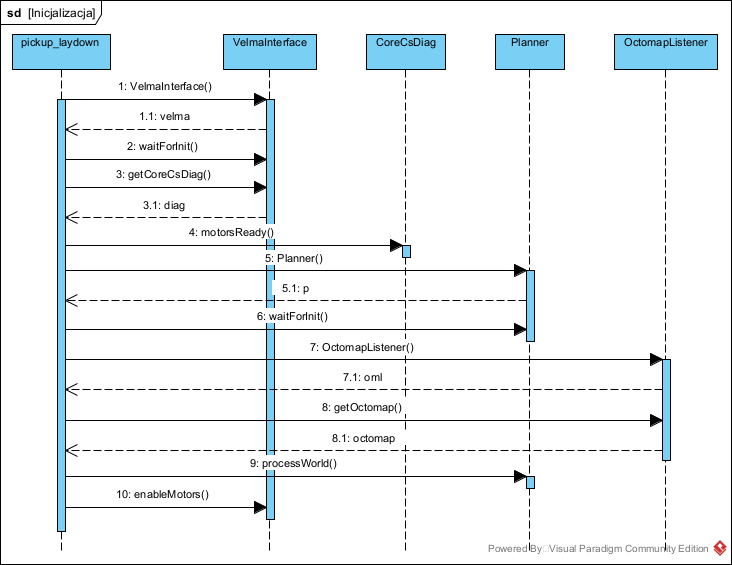
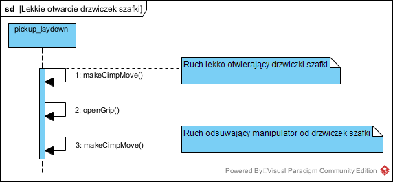
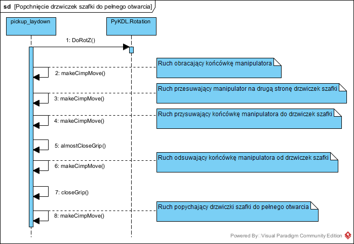
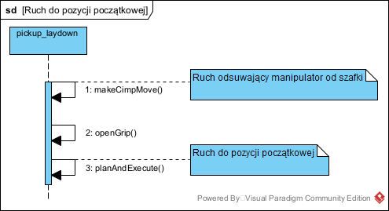
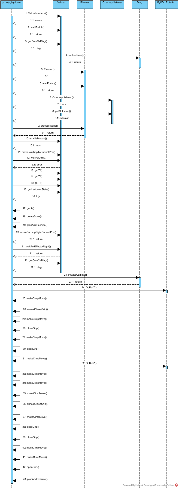
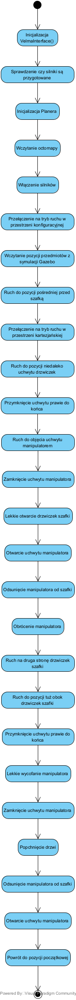
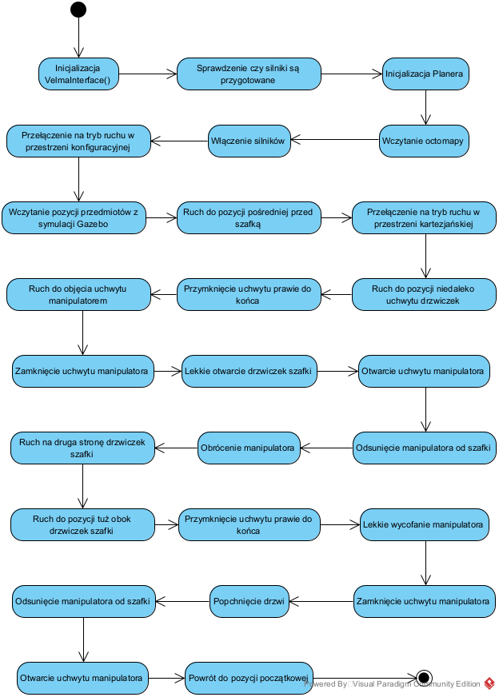

# STERO - Sprawozdanie blok manipulacyjny

## Projekt 1

### Cel zadania

Celem projektu było napisanie programu sterującego robotem Velma, który spowoduje, że robot chwyci, przeniesie i odłoży obiekt w inne miejsce. Zadanie to może być zaprogramowanie z różnym stopniem elsatyczności algorytmu. W ogólności robot powinien dobrze zareagować na zadane podniesienie i odłożenie przedmiotu w dowolnej konfigracji środowiska. Na etapie oddania projektu robot potrafi zdecydować, czy zadanie ma sens (jest w stanie po niego sięgnąć), sięgnąć po obiekt, jeżeli znajduje się w zasięgu i odstawić go na drugi stolik w jedno określone miejsce.

### Pliki i Implementacja

Implemenatcja zadania znajduje się w pliku `pickup_laydown.py` (wersja dokończona, ale nie uwzględniająca odwrotnej kinematyki robota) oraz `my_pickup_laydown.py` (wersja niedokończona z próba uwzlędnienia i przeliczania odwrotnej kinematyki robota). Paczka zawiera skrypt do budowy pełnej octomapy `create_octomap.py`, octomapa używana przy testowaniu zadania to `new_octmap.bt`.

### Rozwój podejścia, zmiany koncepcji i implementacji

Program stopniowo ewoluował. Zaczęto od najprostszej wersji, czyli takiej w której wszystkie pozycje są na stałe zapisane w kodzie w konfiguracji złączy. Stworzono octomapę serwerem online, zapisano ją do pliku i korzytano z niej poprzez serwer offline. 
Następnie dodano planner który sam odnajdował optymalną trajektorię ruchu od pozycji początkowej do szklanki i następnie do pozycji przed odstawieniem.
To działanie pozwoliło nam z wielu pozycji pośrednich zapisanych w kodzie zredukować ich liczbę do zaledwie 3 (wliczając pozycję początkową do której program sam wracał zawsze po odstawieniu słoja). 
Kolejnym krokiem było dodanie sterowania w trybie zadawania pozycji końcówki manipulatora jednej ręki w przestrzeni kartezjańskiej związanej z bazowym układem współrzędnych.
Do tego potrzeba było odczytać pozycję szklanki ze świata rzeczywistego, co zrobiliśmy wczytując pozycję szklanki prosto z programu gazebo symulującego naszą rzeczywistość.
Do pozycji szklanki dodaliśmy stały offset tak, żeby manipulator zatrzymał się kawałek przed słoikiem, żeby mógł go normalnie chwycić. To podejście pozwala na chwycenie szkalnki, która znajduje się w dowolym miejsu osiągalnym przez ramię robota Velma.
Do tej pory wszystko działało poprawnie i rozwiązanie opisane do tego momentu znajduje się w pliku `pickup_laydown.py`. 
Kolejnym etapem było wykorzystanie funkcji liczącej odwrtną kinematykę robota w celu uelastycznienia działania programu. Celem było wyznaczenie pozycji oddalonej od szklanki do wykonania poprzez ruch w jimp (aktulanie jest to stała pozycja pośrednia) i położenia końcowego jako jedngo z najbliższych krańców stołu. Próba realizacji tego zadania znajduje się w pliku `my_pickup_laydown.py`.

### Przestrzeń operacyjna robota

Została określona przy pomocy skryptu `reachability_range.py` z paczki `velma_common`. Została dopasowana do środowiska eksperymentalnie. Przestrzeń fioletowa to obszar, w którego zasięgu robot może dokonywać operacji.

### Struktura programu

Węzeł `pickup_laydown` został zaimplementowany przy wykorzystaniu automatu skończonego. Jego schemat został zaprezentowany poniżej. 

### Działanie programu (środowisko Gazebo)

Inicjalizacja robota.

Ruch do pozycji pośredniej (jimp).

Ruch końcówki w kieunku szklanki (cimp).

Zamknięcie chwytaków, złapanie szklanki.

Uniesienie szklanki (cimp).

Przełożenie szklanki na drugi stolik (jimp).

Otworzenie chwytaka.

Uniesienie chwytaka nad szklankę (cimp).

Ruch do pozycji początkowej (jimp).

### Uruchomienie skryptu

Reset buffers

>rosrun velma_common reset_shm_comm.py

Manipulation velma_system.launch

>roslaunch  manipulation velma_system.launch

Planner launch

>roslaunch velma_ros_plugin velma_planner.launch

RViz

>rosrun rcprg_ros_utils run_rviz.sh

Gazebo

>roslaunch rcprg_gazebo_utils gazebo_client.launch

Octomap offline

>roslaunch velma_common octomap_offline_server.launch  octomap_file:=/home/student/mobile_ws/src/zubik-palczuk/manipulation/data/new_octmap.bt

Table_a gazebo position

>roslaunch rcprg_gazebo_utils gazebo_publish_ros_tf_object.launch link_name:=table_a::link frame_id:=table_a

Table_b gazebo position

>roslaunch rcprg_gazebo_utils gazebo_publish_ros_tf_object.launch link_name:=table_b::link frame_id:=table_b

Jar hollow gazebo position

>roslaunch rcprg_gazebo_utils gazebo_publish_ros_tf_object.launch link_name:=jar_hollow::link frame_id:=jar

Bowl high gazebo position

>roslaunch rcprg_gazebo_utils gazebo_publish_ros_tf_object.launch link_name:=bowl_high::link frame_id:=bowl

Home motors

>rosrun velma_task_cs_ros_interface initialize_robot.py

Pickup_laydown script

>cd /.../manipulation/scripts
>
>python pickup_laydown.py

## Projekt 2

### Cel zadania

Naszym zadaniem było napisać program sterujący robotem Velma, który sprawi, że robot otworzy drzwiczki szafki.
Co ważne, model szafki użyty do symulacji w programie Gazebo miał mieć delikatne i wyłamywalne uchwyty, więc w trakcie realizacji zadania musieliśmy zadbać o to, żeby robot nie zniszczył uchwytów.

### Analiza wymagań

### Pliki i Implementacja

Implementacja tego zadania znajduje się w plikach `open_door.py` oraz `open_door2.py`, świat dużyty do symulacji to `cabinet.world`, natomiast octomapa znajduje się w pliku `cabinet_octomap.bt`. 

### Rozwój podejścia, zmiany koncepcji i implementacji

Zadanie to można wykonać z różnym stopniem elastyczności.
Nasze pierwsze rozwiązanie (`open_door.py`) jest niezawodne i częściowo elastyczne, ponieważ powinno umożliwiać przesunięcie szafki (oczywiście w granicach zasięgu ramiania robota).
Niestety nie umożliwia ono obracania szafką.
Tą funkcjonalność powinno zawierać nasze drugie rozwiązanie (`open_door2.py`).
Ono z kolei nie jest dokończone, nie działa ono zawsze i pewnie.

### Struktura programu

Poniżej zostały przedstawione wybrane elementy systemu sterowania w języku **SysML**:

- Diagram aktywności

- Diagramy sekwencji dla węzła sterującego procesem otwierania szafki, po jednym dla każdej aktywności z diagramu aktywności

  - Inicjalizacja

  - Ruch do pozycji przed złapaniem uchwytu szafki

  - Złapanie uchwytu szafki

  - Lekkie otwarcie drzwiczek szafki

  - Popchnięcie drzwiczek szafki do pełnego otwarcia

  - Ruch do pozycji początkowej

<!-- STARE

- Diagram aktywności dla procesu otwierania szafki

 -->

### Działanie programu (środowisko Gazebo)

Działanie naszego programu zostało pokazane na poniższym filmie.

https://user-images.githubusercontent.com/80065197/148781452-4c7fee18-ad25-42dd-af6b-1e7cbd622d4e.mp4

### Uruchomienie skryptu

Reset buffers

>rosrun velma_common reset_shm_comm.py

Roscore

>roscore

Manipulation velma_system_cabinet.launch

>roslaunch manipulation velma_system_cabinet.launch

Planner launch

>roslaunch velma_ros_plugin velma_planner.launch

RViz

>rosrun rcprg_ros_utils run_rviz.sh

Gazebo

>roslaunch rcprg_gazebo_utils gazebo_client.launch

Octomap offline

>roslaunch velma_common octomap_offline_server.launch  octomap_file:=/home/student/mobile_ws/src/zubik-palczuk/manipulation/data/cabinet_octomap.bt

Cabinet door handle gazebo position

>roslaunch rcprg_gazebo_utils gazebo_publish_ros_tf_object.launch link_name:=cabinet_door_fragile::right_handle frame_id:=right_handle

Robot base gazebo position

>roslaunch rcprg_gazebo_utils gazebo_publish_ros_tf_object.launch link_name:=velma::torso_base frame_id:=base

Home motors

>rosrun velma_task_cs_ros_interface initialize_robot.py

Pickup_laydown script

>cd /.../manipulation/scripts
>
>python pickup_laydown.py
